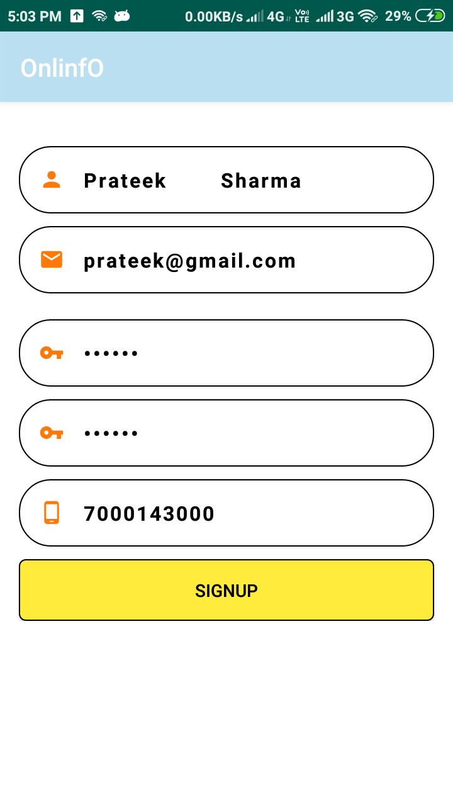
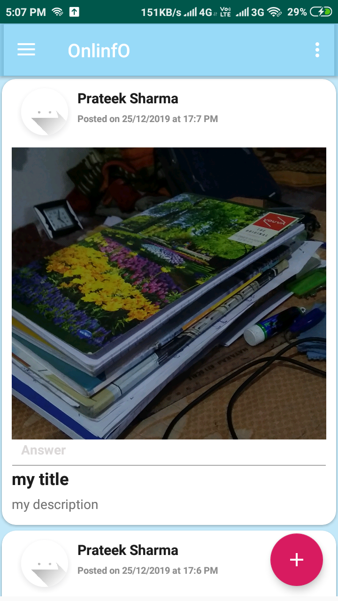
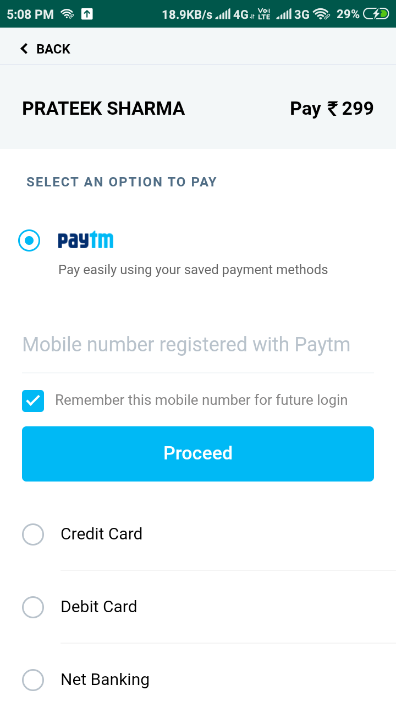
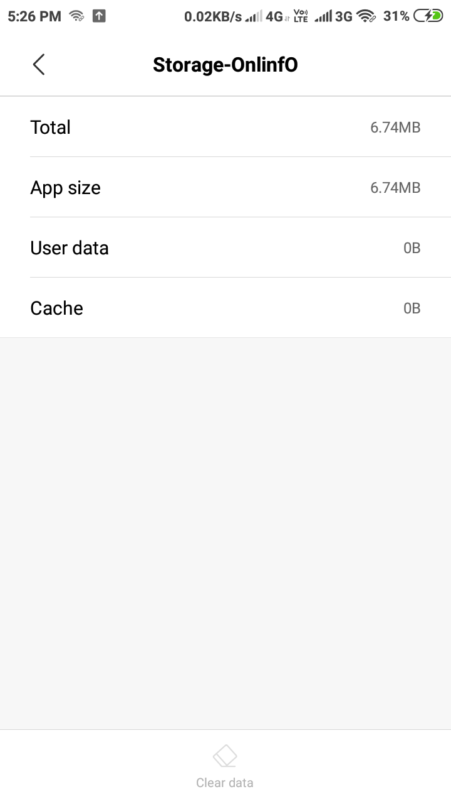

# OnlinfO_information_sharing_social_media_android_app_with_paytm_integration.

It is an android app which uses 'Google Firebase' as its database. It has 'Paytm' integrated within it. The app can be used as a "Social Media" or "Question-Answer app" or a "Goods' selling-buying app".

Features of the app :-
* A user first has to register on the app using his/her email id and password.
* Paytm is used as a payment option
* User can Post photos with their title and descriptions
* Users can comment on the posts
* The app can be used in a college for sharing questions and getting their answers
* It can be used as a Social Media App 
* It can be used as a goods' selling app

                                        
